# MCP Server Sequence Diagram
## Bounty #1926 - Under the Hood Architecture

This diagram shows what happens during the MCP demo, illustrating the full request/response flow from client to CLI execution and back.

```mermaid
sequenceDiagram
    participant Client as Demo Script<br/>(curl/jq)
    participant HTTP as HTTP Server<br/>(Axum)
    participant Session as Session Manager<br/>(HashMap)
    participant MCP as MCP Handler<br/>(JSON-RPC 2.0)
    participant Security as Security Filter<br/>(16 blocked cmds)
    participant ToolGen as Tool Generator<br/>(Dynamic from clap)
    participant CLI as golem-cli<br/>(Command execution)
    participant Golem as Golem Services<br/>(component/worker)

    Note over Client,Golem: 1. Server Startup (golem-cli --serve=8088)

    CLI->>HTTP: Start Axum HTTP server
    HTTP->>Session: Initialize SessionManager
    HTTP->>ToolGen: Generate tools from CLI commands
    ToolGen->>ToolGen: Parse clap structure
    ToolGen->>Security: Filter sensitive commands
    Security-->>ToolGen: Return 70 safe tools
    ToolGen-->>HTTP: Tools cached in memory
    HTTP-->>CLI: Server ready on :8088

    Note over Client,Golem: 2. Initialize MCP Session

    Client->>+HTTP: POST /mcp<br/>initialize(protocolVersion, clientInfo)
    HTTP->>MCP: Parse JSON-RPC request
    MCP->>Session: Create new session
    Session->>Session: Generate UUID session_id
    Session-->>MCP: session_id
    MCP->>MCP: Build capabilities response<br/>(tools, resources, SSE)
    MCP->>HTTP: Set header: mcp-session-id
    HTTP-->>-Client: SSE: data: {result: {capabilities}}<br/>Header: mcp-session-id: <uuid>
    Client->>Client: Extract session_id from header

    Note over Client,Golem: 3. Initialized Notification

    Client->>+HTTP: POST /mcp<br/>notifications/initialized<br/>Header: mcp-session-id
    HTTP->>Session: Validate session exists
    Session-->>HTTP: Session valid
    HTTP-->>-Client: 200 OK (no response body)

    Note over Client,Golem: 4. List Available Tools

    Client->>+HTTP: POST /mcp<br/>tools/list<br/>Header: mcp-session-id
    HTTP->>Session: Get session by ID
    Session-->>HTTP: Session found
    HTTP->>ToolGen: Get all tools
    ToolGen->>Security: Filter command list
    Security-->>ToolGen: 70 safe commands
    ToolGen->>ToolGen: Generate MCP tool schemas<br/>(name, description, inputSchema)
    ToolGen-->>HTTP: Array of tool definitions
    HTTP->>MCP: Format as JSON-RPC response
    MCP->>HTTP: SSE response
    HTTP-->>-Client: SSE: data: {result: {tools: [...]}}

    Note over Client,Golem: 5. Call Tool: --version

    Client->>+HTTP: POST /mcp<br/>tools/call("--version", {})<br/>Header: mcp-session-id
    HTTP->>Session: Validate session
    Session-->>HTTP: Valid
    HTTP->>MCP: Parse tool request
    MCP->>Security: Check if "--version" is allowed
    Security-->>MCP: Allowed (safe command)
    MCP->>CLI: Execute: golem-cli --version
    CLI->>CLI: Print version info to stdout
    CLI-->>MCP: Output: "golem-cli 0.x.x..."
    MCP->>MCP: Wrap in MCP response<br/>{isError: false, content: [{text}]}
    MCP->>HTTP: Format SSE response
    HTTP-->>-Client: SSE: data: {result: {content: [{type: "text", text: "golem-cli..."}], isError: false}}

    Note over Client,Golem: 6. Call Tool: component list (with services)

    Client->>+HTTP: POST /mcp<br/>tools/call("component list", {component_name: ""})
    HTTP->>Session: Validate session
    Session-->>HTTP: Valid
    HTTP->>MCP: Parse tool request
    MCP->>Security: Check if "component list" is allowed
    Security-->>MCP: Allowed
    MCP->>CLI: Execute: golem-cli component list
    CLI->>+Golem: HTTP GET localhost:9881/v1/components
    Golem->>Golem: Query component database
    Golem-->>-CLI: JSON: [{id, name, version}...]
    CLI->>CLI: Format as table/JSON
    CLI-->>MCP: Output: component list table
    MCP->>MCP: Wrap in MCP response
    MCP->>HTTP: SSE response
    HTTP-->>-Client: SSE: data: {result: {content: [{text: "..."}], isError: false}}

    Note over Client,Golem: 7. Resources Discovery (golem.yaml)

    Client->>+HTTP: POST /mcp<br/>resources/list
    HTTP->>Session: Validate session
    Session-->>HTTP: Valid
    HTTP->>MCP: Parse request
    MCP->>MCP: Walk directory tree<br/>Search for golem.yaml files
    MCP->>MCP: Found: ./examples/golem.yaml
    MCP->>MCP: Build resource URIs<br/>(file://<path>)
    MCP->>HTTP: Resource list response
    HTTP-->>-Client: SSE: data: {result: {resources: [{uri, name, mimeType}]}}

    Note over Client,Golem: 8. Error Handling: Blocked Command

    Client->>+HTTP: POST /mcp<br/>tools/call("cloud token", {})
    HTTP->>Session: Validate session
    Session-->>HTTP: Valid
    HTTP->>MCP: Parse tool request
    MCP->>Security: Check if "cloud token" is allowed
    Security-->>MCP: BLOCKED (sensitive command)
    MCP->>MCP: Build error response
    MCP->>HTTP: Error response
    HTTP-->>-Client: SSE: data: {result: {content: [{text: "Error: Tool 'cloud token' not found"}], isError: true}}

    Note over Client,Golem: Key Implementation Details

    Note over ToolGen: Tool Generation (Startup)<br/>- Parse clap Command structure<br/>- Extract all subcommands recursively<br/>- Generate JSON Schema from arg types<br/>- Filter via security.rs<br/>- Cache in memory

    Note over Security: Security Filtering<br/>16 blocked patterns:<br/>- profile *<br/>- cloud token *<br/>- cloud account grant<br/>- cloud project grant<br/>- cloud project policy *<br/>- account get<br/>- account add<br/>- grant *<br/>- etc.

    Note over MCP: JSON-RPC 2.0 Handler<br/>- Parse jsonrpc, id, method, params<br/>- Dispatch to handlers:<br/>  * initialize<br/>  * tools/list<br/>  * tools/call<br/>  * resources/list<br/>  * resources/read<br/>- Wrap responses in SSE format

    Note over HTTP: SSE (Server-Sent Events)<br/>Format: "data: {json}\n\n"<br/>- One event per response<br/>- Includes session headers<br/>- Supports streaming (future)

    Note over Session: Session Management<br/>- HashMap<SessionId, Session><br/>- Thread-safe with Arc<RwLock><br/>- No expiration (server lifetime)<br/>- Future: Add TTL cleanup
```



## Key Architectural Points

### 1. Dynamic Tool Generation
- Tools are NOT hardcoded
- Generated at startup from `clap` command structure
- Automatically includes all CLI subcommands
- Security filter applied post-generation

### 2. Security Model
- Whitelist approach (only safe commands exposed)
- Sensitive commands filtered in `security.rs`
- No authentication (local-only server)
- Session isolation per client

### 3. Protocol Compliance
- Full MCP 2024-11-05 spec implementation
- JSON-RPC 2.0 message format
- SSE transport layer
- Required handshake: initialize → initialized

### 4. Execution Model
- Tools execute actual CLI commands
- Real output captured from stdout/stderr
- No mocking or simulation
- Golem services interaction is real (when running)

### 5. Response Format
```json
{
  "jsonrpc": "2.0",
  "id": 3,
  "result": {
    "content": [
      {
        "type": "text",
        "text": "actual CLI output here"
      }
    ],
    "isError": false
  }
}
```

## Files Involved

- **Entry Point**: `cli/golem-cli/src/main.rs` (--serve flag)
- **HTTP Server**: `cli/golem-cli/src/mcp_server/mod.rs`
- **Tool Generation**: `cli/golem-cli/src/mcp_server/tools.rs`
- **Security**: `cli/golem-cli/src/mcp_server/security.rs`
- **Session Management**: In-memory HashMap in `mod.rs`

## Test Coverage

- **Unit Tests**: `security.rs::tests` (7 tests)
- **Integration Tests**: `tests/mcp_server_integration.rs` (5 tests)
- **Demo Scripts**:
  - `demo-mcp-verified.sh` (verifies actual outputs)
  - `test-mcp-tool-execution.sh` (CI validation)
  - `demo-mcp-with-services.sh` (full stack integration)
