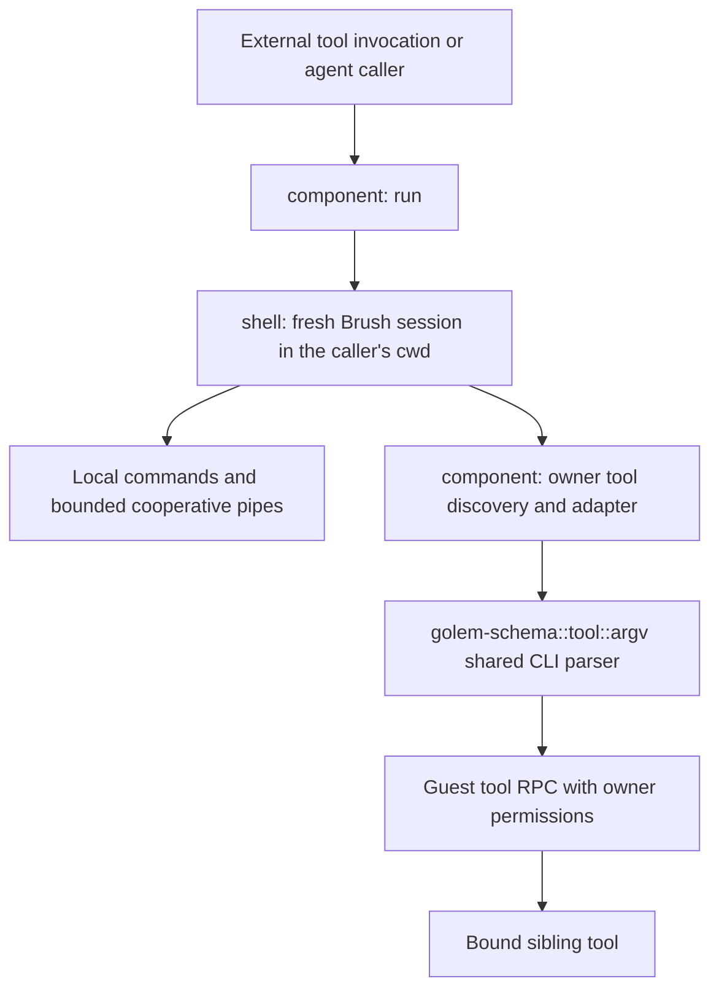

# Bash built-in tool

This standalone Golem application builds the component embedded by the registry service as the
grantable `bash@0.2.0` system tool. It exports one command, `run`, for finite shell execution. A
call accepts a starting directory and a script, runs the script in a fresh shell, then returns
captured stdout, captured stderr, the exit code and the directory the script ended in.

## Enable and invoke

Select the exact release and explicitly bind it to an agent in the consumer's manifest:

```yaml
tools:
  bash:
    release:
      account: builtin-tool-owner@golem.cloud
      name: bash
      version: "0.2.0"
agents:
  MyAgent:
    tools:
      bash:
        filesystemAccess: allowed
```

The built-in inventory does not bind tools or grant file access automatically. Each sibling tool
needs its own binding and filesystem grant. After deploying and creating the owner, invoke:

```shell
golem tool invoke --agent 'MyAgent("one")' bash -- run 'printf ready; exit 7'
```

The successful RPC contains `stdout: "ready"`, empty stderr, `exit_code: 7` and `cwd: "/"`. To
continue where a script left off, pass its returned `cwd` as `--cwd` on the next call. `golem ssh`
is not needed to use this component.

## Contract

```text
run(cwd: string = "", script: string, timeout: u32 = 600)
  -> { stdout: string, stderr: string, exit_code: u8, cwd: string }
```

`script` is positional; `cwd` and `timeout` are options. A script still running `timeout` seconds
after the call started (600 by default, at most 3600; otherwise the declared `invalid-timeout`
error, before anything runs) is stopped as `timeout(1)` stops a command: TERM to the script and
everything it started, so its TERM trap runs, and KILL a second later. The call then returns what
the script wrote, exit code 124 and `bash: the call exceeded its 600 s time limit` on stderr. Each call creates a fresh shell, as `bash -c`
does, and completes all owned tasks before returning. Output is collected until completion; it is
not a live terminal. The shell reads no startup files (`/etc/profile`, `~/.bashrc`). An agent has
no HOME unless its configuration sets one and no passwd entry, so, as in bash, `~` expands to `/`
and `cd` with no operand fails with `HOME not set`. The shell presents itself as bash on Linux,
whose behaviour it and its commands follow: `OSTYPE` is `linux-musl` and `MACHTYPE` (and
`BASH_VERSINFO[5]`) `wasm32-unknown-linux-musl`, so a script that branches on `$OSTYPE` takes its
Linux path; `HOSTTYPE` is `wasm32`.
Captured bytes are converted to UTF-8 strings with replacement for invalid sequences. Binary data
should remain in files or local pipelines rather than the result's text fields.

Only the working directory crosses calls, and only because the caller passes it. `cwd` must be
an absolute path to an existing directory; otherwise the call returns the declared `invalid-cwd`
error before the shell starts, so no part of the script runs. An empty `cwd` starts where a fresh
shell starts, `/`. Everything else ends with its call: variables, functions, aliases, options,
traps, `$?`, positional parameters, the directory stack and jobs, and each call gets a new `$$`.
Tool access is rediscovered from the current owner on each call.

Anything a later call needs goes in the owner's files, which every call shares. A script that wants
its settings back writes them to a file and a later call sources it:

```shell
declare -p PROJECT >settings.sh; declare -f build >>settings.sh   # one call
. ./settings.sh; build                                              # a later one
```

Nothing is read implicitly: a call sources a file only when its script says so.

Human questions, approval grants, special `sudo` handling and AI commands are absent. Permitted
operations execute directly under Golem's binding, filesystem and middleware rules. Background
jobs (`&`, `wait`, `jobs`, `kill`, `$!`, `$$`) run within one call: jobs still running when the
script ends, wherever they were started and whether disowned or not, are sent HUP, then KILL after
one second, and reported on stderr. See
[docs/process-model.md](docs/process-model.md). `coproc` is refused. Process substitution is
buffered, since there are no processes to run alongside the command: `<(list)` runs to completion
first and the command reads its output as `/dev/fd/63`; `>(list)` keeps what the command writes and
runs on it once the command has finished, so its output follows the command's. After `exec`
(`exec > >(tee log)`), the substitution runs alongside the shell and reads what the shell writes
until the descriptor closes or the script ends. Functions, ordinary
subshells, `$(...)` and `select` are supported.
No tasks, permissions or pending workflows outlast a call.

## Implementation



- `shell/` and `utilities/` are reusable Rust libraries with no Golem dependency. The shell uses
  Brush's cooperative execution services and runs every command below in-process. HTTP helpers
  expose the supported `curl` and `wget` options, including downloads relative to the shell's cwd.
  `curl -i`/`-I`/`-v` and `wget -S` print response headers sorted by name, not wire order: a
  header-iteration order that could vary between a recorded run and a replay would make Golem
  refuse to resume it (`Unexpected oplog entry`), so a stable order is chosen deliberately over
  reproducing curl's own presentation.
- `component/` exports the SDK tool, supplies Golem's guest task/timer services before shell
  initialization, checks the starting directory, and adapts discovered owner bindings into
  commands.
- `golem-schema::tool::argv` is also used by the native CLI. Bash passes shell-expanded arguments
  to it; there is no second tool argument grammar. Local commands win name collisions, with a
  diagnostic identifying shadowed tools. Unsupported secret/capability arguments are refused.
- Every wait in the shell — `sleep`, `tail -s`, the grace period for leftover jobs, and
  `curl --retry-delay` — goes through Golem's durable monotonic clock, and every "now" (`find
  -mtime`, `date`, `touch`) through its recorded wall clock, so a script recovered after a crash
  sees the same times it saw before.
- HTTP requests go through Golem's durable `wasi:http`. After a crash, a request that had not
  finished is sent again: a GET, HEAD, PUT, DELETE, OPTIONS or TRACE with the same
  `Idempotency-Key` header Golem gave it, a POST or PATCH (which Golem does not assume to be
  idempotent) with a new one, so the server may see such a POST or PATCH twice. A script that needs
  exactly-once should send its own key, which Golem then keeps on the resent request:
  `curl -H 'Idempotency-Key: order-42' -d @order.json https://api.example.com/orders`.
- Diagnostics that a caller could miss — a rejected directory, a tool call that failed, a job
  stopped at the end of a run, a refused script — are also written to the agent's log at `warn`
  or `error` (`golem agent oplog` shows them as log entries). stderr is unchanged. Nothing is
  logged per command or per record: each line is an oplog entry.
- Local pipe buffers default to 64 KiB. Full buffers suspend writers and empty buffers suspend
  readers. A synchronous builtin (`declare -p`, `type`, `set`) cannot be suspended, so its output
  goes into the buffer whole, up to 64 MiB. This path has no sequential pipeline fallback. Closing a reader does not cancel a
  sleeping producer or an accepted tool call; an actual failed write follows SIGPIPE disposition.
- Bound commands collect stdin, await the RPC, then forward the completed output. Input pumping,
  output draining and terminal waiting run together; independent local stages can progress. Each
  attachment is limited to 16 MiB, the host's `max_tool_attachment_bytes`. The call's own output and substitutions are bounded too; see
  [Limits](#limits).

## Commands

Besides Bash's own builtins, these commands run in-process. There is no process spawning, so
features that need one, or that this platform has no equivalent for, are refused with exit status 2
and a `… is unsupported in bash-tool` diagnostic, never silently skipped: `find -ok`, `xargs -p`,
`umask`, `ulimit`, `enable -n` of a Bash builtin, `enable -f`, `exec -a`/`-c`/`-l`, `bg`, `fg`, `fc`,
`[[ -N ]]`, `cd -@`, `bash -r`/`--restricted`,
`bind -l`/`-p`/`-P`/`-s`/`-S`/`-v`/`-V`/`-q`/`-u`/`-X` (they would need readline's real default
emacs/vi keymap and variable tables to answer faithfully; a *binding* form, such as
`bind '"\C-x": "x"'` or `bind -x`/`-f`/`-r`/`-m`, has nothing to query, so it prints bash's own
`bind: warning: line editing not enabled` and succeeds, matching bash's own non-interactive
behavior exactly),
`help -m`, `suspend -f` (it would stop every process of the call until a `CONT` nothing outside the
call can send), `env -a` for any command but `sh -c` and `bash -c` (whose `$0` it sets; nothing
else here has an argv[0] to give), `source /dev/stdin` (source checks a whole script before it
runs, and a call cannot wait there for a stream still being written), and running a program or script
file (`./build.sh`: `executing files is unsupported in bash-tool`, with bash's status for a file it
cannot execute, 126). A path that names nothing or a directory fails as in bash (`No such file or
directory`, 127; `Is a directory`, 126). Likewise `diff`'s `-d`/`--minimal`, `-n`/`--rcs`,
`-p`/`--show-c-function`, `-I`/`--ignore-matching-lines` and `-F`/`--show-function-line`; `cmp`'s
`-n`/`--bytes`; and `patch`'s `-f`/`--force`, `-F`/`--fuzz` and
`-d`/`--directory` — all real GNU options this build doesn't implement, refused loudly rather than
misread as an unrecognized flag. `diff -y`, `diff -e` and `diff` of non-UTF-8
files run an engine that needs memory for every pair of differing lines, so they refuse inputs with
more than about 4,000 differing lines on each side (`… on files this large is unsupported in
bash-tool`). `numfmt --padding` and `find -printf`'s field widths/precisions turn directly into
that many bytes of padding, so both are capped at 16 MiB (`numfmt: --padding above 16777216 is
unsupported in bash-tool`, exit 2; `find: -printf with a field width/precision this large is
unsupported in bash-tool`, exit 2) instead of attempting an unbounded allocation. `sed`'s compiler
parses nested `{ }` blocks with an explicit stack rather than recursing natively, but still frees a
compiled script's command chain by recursing once per nesting level with no explicit stack — under
WASI that overflows and traps with no way to recover — so it refuses past 5,000 nested `{ }` blocks
in a script (`` sed: SCRIPT:LINE:COL: error: `{' blocks are nested too deeply ``, status 1); GNU sed
has no comparable limit. `jq` parses, compiles and evaluates a program recursively, on the stack the
shell itself uses, so it refuses a program nested more than 256 levels deep — each parenthesised or
bracketed query, object, `if`, `try`, `reduce`/`foreach`, `label`, definition body, function
argument, string interpolation, unary minus, pattern and `?//` alternative is a level — and fewer
when it runs deep inside nested shell calls, before any of it runs (`jq: maximum nesting level
exceeded: deeper nesting is unsupported in bash-tool`, status 2). Flat chains are not nesting: `,`
(a literal array of 10,000 elements), `|`, `as` bindings, arithmetic, `and`/`or`/`//`, path parts,
string parts, object entries and pattern elements run to jq's own limits (jq's `function compiled
to N bytes which is too long`, for about 3,500 `and`s, is not reproduced: such a chain runs).
Evaluation that would recurse past the stack left stops with the same refusal and status, after
the outputs before it: a recursive definition that is not a tail call, from about 90 levels deep
at the top level (tail calls do not recurse), and `walk`, `flatten`, `del`, `paths`-driven updates,
`setpath` and `|=` through values or paths nested a few hundred levels deep; jq runs these. Values
themselves are compared, contained, merged, printed and freed without recursing, however deep: as
jq, printing and `tojson` write anything nested more than 10,000 levels deep as `<skipped: too
deep>`, while jq's errors for comparing, containing and merging values or following paths nested
more than 10,000 levels deep (`Comparison too deep` and its siblings) are not reproduced — those
succeed. `jq`'s JSON reader is capped at 3,000 open arrays, objects and object keys, counted as jq
counts them (`jq: parse error: Exceeds depth limit for parsing at line L, column C`, status 5 —
jq's own message, which jq gives at 10,000).
`jq` does not load modules: an `import` or `include` of a module jq would find on its search
path (`-L`, or `~/.jq`) is refused before the program runs (`jq: module imports are unsupported
in bash-tool`, status 2), and one it would not find is jq's own `module not found` error (status
3); `modulemeta` is refused where it runs
(`jq: modulemeta is unsupported in bash-tool`, status 2); `get_search_list` still reports jq's search
path. `jq`'s regular expressions run on the `regex-bites` engine rather than Oniguruma: a pattern
that does not compile fails with status 5 as in jq, but with that engine's message
(`invalid regex: found open group without closing ')'`, where jq says
`Regex failure: end pattern with unmatched parenthesis`); with the `i` flag it ignores the case
of letters beyond ASCII one letter at a time (`é` matches `É`), where Oniguruma also folds one
letter to several (`ß` matches `SS`). sed's `e` command and `s///e` are refused too, with this canonical wording (exit status 2,
`sed: the 'e' command and substitute flag are unsupported in bash-tool: no shell to run`) — its
own compile-time refusal (before any input line is read), reworded to match every other refusal
here instead of the fork's own status/wording. A refused command
the script names outright refuses the whole script before any of it
runs; one reached another way (through `eval`, a variable) fails where it is reached — exit status 2
for that command — and the script continues. Text the shell runs that the script does not spell
out is checked as `eval`'s is, when it is reached: the command substitutions of `PS4` and `${x@P}`,
and the command `compgen -C` runs. A refused `${x@P}` fails like an expansion error, with status 2,
and a refused `PS4` is traced as written, as bash uses a prompt it cannot expand. `exec cmd` runs `cmd` and then ends the script with its
status, as replacing the shell would; a failed `exec` (the command cannot be found) ends it the same
way. `sh -c` and
`bash -c` run their script through this same shell as an isolated child — `cd`, assignments and
`exit` stay inside it — so `find -exec sh -c …` and `xargs bash -c …` work; script files and
interactive shells are refused, and `sh -c SCRIPT NAME ARGS…` sets `$0` to `NAME` as bash does.
`env [-i] [-u NAME] [-C DIR] [NAME=VALUE]… COMMAND` and `split --filter=COMMAND` run their command
the same way, with the environment `env` describes and, for `split`, each piece on standard input
and its name in `$FILE`.
`bash run …` still invokes the bound bash tool.

`history` keeps a real, working in-memory list — `-s` appends an entry, `-c` clears it, `-d`
deletes one, `-p` expands `!`-event references (`!!`, `!N`, `!-N`, `!string`, `!?string?`) and
prints the result without running it, and `-a`/`-n`/`-r`/`-w` read or write it against a file
(`$HISTFILE` by default). Nothing auto-records into it, though, matching real bash's own
non-interactive behavior: only what a script itself adds with `-s` (or reads in with `-r`/`-n`)
is ever in it.

`eval` and `source`/`.` share the top-level script's all-or-nothing rule: the whole `eval`
argument, or the whole sourced file, is checked for syntax errors before any of it runs, so a
later syntax error means nothing earlier ran either — unlike bash itself, which executes each
command as it is read and so can run earlier commands before reaching a later syntax error.
As in bash, which parses a `$( )`, `<( )` or `>( )` with the command it is in, a syntax error
inside one names the line of the script (or `eval` text, or file) it is on, quotes that whole
line, and exits with 127: in `eval` or a sourced file it ends the shell (a subshell with 1).
Backquotes are parsed only as they run, so a syntax error in one is reported then
(``bash: command substitution: line 2: ...``) and the command goes on. An `eval`'s here-document
left open runs to the end of its text with bash's warning, as a script's does.
`source`/`.` also follows bash's `sourcepath` behavior: a name with no `/` is searched for in
`$PATH` when it is not found relative to the working directory. Sourcing `/dev/stdin`,
`/dev/stdout` or `/dev/stderr` is refused (reading one synchronously, before the pipeline feeding
it can run, would block forever here); a process substitution's `/dev/fd/N` is buffered, not
live, so `source <(cmd)` works.

`find` walks each directory's entries in byte order rather than GNU's own readdir order (POSIX
leaves the order unspecified, and a run recorded in one readdir order that replayed in another
would again risk `Unexpected oplog entry`), so results can list siblings in a different order
than GNU `find` would for the same directory.

An agent's filesystem has no `/dev`, but `/dev/null`, `/dev/stdin`, `/dev/stdout`, `/dev/stderr`
and `/dev/fd/N` work wherever a command takes a file operand, and `test` sees `/dev/null` as a
character device: the shell answers those paths itself (`shell/src/tools/devices.rs`). As on
Linux, `/dev/stdin` on a pipe shares the pipe (`paste /dev/stdin /dev/stdin` takes turns), `/dev/fd/N`
on a regular file opens that file again with its own position, and `/dev/fd/N` for a closed
descriptor does not exist. `/dev/null` keeps nothing, and nothing is written for it. WASI files
have no permission bits or owners, so `test`'s `-r` and `-w` report whether the filesystem lets
the shell read or write the path, `-x` holds only for directories (nothing can be executed), `-O`
and `-G` hold for every existing path (the agent owns its whole filesystem), and `-ef` compares
device and inode. A symbolic
link to an absolute path cannot be created on WASI, so `ln -s /abs/path link` is refused with that
reason; relative targets work. Nor can a file whose name holds bytes that are not UTF-8, since WASI
names files with Unicode strings: creating one fails with `Illegal byte sequence`. Shell values
themselves keep such bytes, as bash's do. A script with a syntax error is refused whole, before any of it runs,
with bash's message (``bash: -c: line 2: syntax error near unexpected token `then'``).

| Commands | Source |
|---|---|
| `b2sum base32 base64 basename basenc cksum comm cp csplit date dd dirname du env expand expr factor fmt fold join link ln ls md5sum mkdir mktemp mv nl numfmt od paste readlink realpath rm rmdir sha1sum sha256sum sha512sum shuf sort split touch truncate tsort unexpand unlink uname nproc` | uutils Coreutils fork, run to completion on the command's input |
| `cat cut head printf sleep tail tee tr uniq wc` | Coreutils fork, with drivers that stream one record at a time |
| `sed` | uutils sed fork with a record-at-a-time engine; `-i` and `-s` run on whole files |
| `grep` | GNU grep 3.12 options and BRE/ERE dialect, over `regex` and `fancy-regex` (`-P`, back-references) |
| `jq` | jaq with jq's CLI options and a jq-compatible fork of `jaq-json` |
| `diff` | uutils diffutils formatters, driven by our own CLI (`-r`, `-N`, `-q`, `-y` and more) |
| `patch` | `diffy`'s parser, with our own hunk application: offsets, per-hunk `.rej` files, `-p`, `-R`, `-N`, `--dry-run`, `-o` |
| `cmp find xargs sh bash yes seq rev tac file stat which man hostname install printenv timeout` | This crate |
| `curl wget` | `utilities/wcurl` and `utilities/waget` over `utilities/whttp` |

The commands in this table (and bound tools) also answer to their program paths, as on a
merged-`/usr` Linux system: `/bin/cat f`, `/usr/bin/env x=1 printenv x`, `"$(which jq)" .` and
`xargs /bin/echo` run the command, `[ -x /bin/cat ]` holds, and `which`, `type`, `command -v` and
`hash` report `/bin/cat` as bash reports a program found on `PATH` (`[ -x "$(command -v jq)" ]`
holds). Of Bash's builtins, only those that also ship as programs and cannot change the shell
(`echo printf test [ true false pwd kill`) have program paths, and `type` still calls them
builtins; `/bin/read` or `/bin/cd` is not found, as on Linux. To `builtin`, `enable`, `help`
and `compgen -b` these commands are not shell builtins, as in Bash (`builtin cat`: `not a shell
builtin`, status 1; `help cat`: `no help topics match`), and `compgen -c` lists them as commands. The programs are not files: `/bin`
and `/usr/bin` are not directories (`ls /bin`, `[ -e /bin/cat ]` fail), and any other file there
is refused as a program file is.

**Not included yet: `awk`.** No Rust awk is trustworthy enough to embed today. uutils/awk, the
intended engine, still lacks `for (k in a)`, `getline`, output redirection and range patterns
(its progress issue is uutils/awk#16); the smaller alternatives are single-maintainer projects.
Until it is ready, use `cut`, `sed`, `grep`, `sort` and `jq`; `awk` reports "command not found".

`install` copies files and creates directories -- `SOURCE DEST`, `SOURCE... DIRECTORY`, `-d`, `-D`,
`-t DIR`, `-v`, and `-b`/`-S SUFFIX` for a simple (non-numbered) backup -- but it is a hand-written
tool here, not the uutils fork's own `install`: that one needs uucore's `entries` and `perms`
features (user/group lookup, `chown`) and rustix's `process` feature for `geteuid`/`getegid`, and
none of those build for WASI at all -- the whole features are `#[cfg(unix)]`-gated upstream, not
just the calls inside them, since WASI has no user or group model for them to wrap. Porting that
is a change to shared `uucore` infrastructure every other tool also links against, not a
self-contained one for this crate. `-m`/`-o`/`-g` are accepted and ignored instead, the same
reason `chmod` refuses outright (see below): WASI has no permission bits or owners for them to
change (`ls`/`stat` already answer this sandbox's one fixed mode by file type; see
[Limits](#limits)).

`chmod` always refuses: `chmod: changing file modes is unsupported in bash-tool`, exit 2. `uname`'s kernel-identity fields
are this sandbox's own fixed, documented answers, not `platform_info`'s real (but WASI-runtime,
not Linux-shaped) ones: `-s`/`-o` say `Linux`/`GNU/Linux` and `-m` says `wasm32`, matching
`$OSTYPE=linux-musl` (see [Contract](#contract)); `-n` matches the `hostname` builtin's own answer
(the `GOLEM_WORKER_NAME` environment variable, falling back to `localhost`); `-r`/`-v` are a
synthetic modern-kernel-shaped placeholder (`6.1.0`/`#1 SMP`) since no real kernel backs this
sandbox, and `-p`/`-i` report `unknown`, as real `uname` does on a modern Linux system. `nproc`
always reports `1`, this sandbox's one logical core. `dd` runs its progress reporting and its
one-second status-line timer synchronously instead of on a background thread — WASI has no
threads at all here, so `thread::spawn` itself panics rather than returning an error — meaning
`status=progress`'s live ticking during a long copy can't happen (nothing can run concurrently
with the copy loop), though the same final transfer summary still prints once the copy
finishes; `status=none` and every other form (`if`/`of`/`bs`/`count`/`skip`/`seek`/
`conv=notrunc`) behave as GNU's do. `du` has no real inode/device numbers or on-disk block
counts on WASI — there is no stable Rust API for either there, `std::os::wasi::fs::MetadataExt`
is nightly-only (rust-lang/rust#71213) — so it reports every file as its own hard-link group (no
cross-operand or hard-link dedup) and approximates block usage by rounding each file's length up
to a 512-byte block; both mean its numbers can differ noticeably from a real filesystem's, whose
own directory-entry and small-file block accounting is itself filesystem-specific (ext4, tmpfs
and xfs already disagree with each other for the same tree) and not something any portable
implementation could match exactly. `-a`, `-c` and `-h` all work: it is the byte counts
themselves that are approximate, not the shape of the output.

`fmt` has two known residual gaps in its line-fill, both found while fixing the goal-width
rounding bug above, and both left as-is rather than chased further. First, at very narrow widths
(roughly 12-25 columns) GNU sometimes excludes a word that technically still fits the line; the
fork's Knuth-Plass port fits it instead. Second, and more fundamentally: GNU's fill is a genuinely
global optimization over the whole paragraph, so a middle line's chosen break can depend on the
*content of later lines* (appending a sentence at the very end of a paragraph was observed to
change an earlier line's break point, at the same width, with nothing else about that earlier
text changed). Reproducing either exactly would mean diffing against GNU's actual `fmt.c` line by
line — unlike the goal-width fix, which was independently derivable from `fmt --help`'s documented
93% ratio, nothing about these two edge cases is verifiable without that source, which isn't
available to check a port against here. Porting blind, from memory of "roughly what GNU's
algorithm does," risks trading a documented, narrow gap for an undocumented, unverified one.

Some already-embedded commands also stop short of GNU's edge cases rather than refuse them
outright. `rm -rf DIR/` (a trailing slash on a directory operand) fails on this platform's own
`(os error)` wording instead of GNU's, rather than removing the directory as GNU does; `rmdir
DIR/` matches GNU (it removes the directory, trailing slash and all). `ln -sr` (relative symlink)
is refused whenever the source resolves to an absolute path, the same "links to absolute paths
are unsupported in bash-tool" limit every `ln -s` hits on WASI (see above) — `-r` itself parses
fine. `tac -s`/`-b` run as GNU's; `tac -r` (a GNU regex separator) is refused. `xargs` does
split one long argument list across several invocations of the command, the way GNU's own size
limit forces it to. `cp -p`/`-a` of a non-regular source such as `/dev/fd/N` on a pipe streams
its bytes directly rather than going through `fs::copy` (whose generic, non-Linux fast path
requires a regular file); permissions are still preserved separately, same as for a regular
source. `file` recognizes JSON the way libmagic does: a top-level object or array that parses
in full (`serde_json`, already in the dependency tree) reports `JSON text data`; a bare scalar
like `42` or `true`, or valid JSON with trailing garbage after it, does not, matching real
`file`. HTML, XML and CSV are not detected at all (no such check here yet); they fall through
to plain `ASCII`/`Unicode text`, unlike real `file`'s `HTML document, ...`/`XML ... document,
...`/`CSV ...` prefixes. None of these are silently wrong: each either matches GNU for the
common case or fails loudly.

Commands that read input stream it, so `while :; do echo x; done | sed 1q` ends. The commands the
table says run to completion are synchronous code: they get their piped input before they start and
their piped output is forwarded when they finish, so an endless producer or consumer meets the
limits below rather than running forever. Their standard streams are served in memory; a command
whose input or output is a file (`< f`, `> f`) reads or writes it directly. `tac` reads files
backwards, as GNU does, so any size works; `sort` and `jq -s` hold all of their input. Diagnostics match GNU wording where the
[conformance matrix](conformance/README.md) compares them;
deliberate differences have per-case fixtures.

Independent provider stderr and the SDK's optional-argument encoding correction are separate
integration gates. Captured shell diagnostics work today; they do not demonstrate a provider fd 2
channel. Tests use supported sibling argument shapes. See [acceptance evidence](ACCEPTANCE.md).

## Limits

Bash has no fixed limit for these; the tool must, because running out of memory or stack traps
the owning agent. Each limit ends in an error message and a nonzero status, never a trap. One
number, 64 MiB, bounds everything bash-tool holds in memory at once for a single buffer: a call's
stdout and stderr, each substitution, a finite command's piped input and output, and a
synchronous builtin's output into a pipe.

- **Time.** A call runs for at most its `timeout` argument (600 s by default, at most 3600 s;
  see [Contract](#contract)). The limit reaches a loop of commands that never wait
  (`while :; do x=1; done`): the shell lets the call's timers run every 64 commands. It cannot
  stop one command that computes for long without waiting (a `sort` of a large file, a regular
  expression that backtracks), which ends first. `timeout DURATION COMMAND` limits one command, as
  GNU's does, with its options, signals and statuses (124 on timeout, 137 on KILL). A `sh -c` or
  `bash -c` runs inside the process the signal ends rather than replacing it, so a TERM trap set
  inside that nested shell does not run; one set by the call's script does. `env
  --block-signal` holds a signal off from its command as `--ignore-signal` does (nothing in a call
  could deliver it once unblocked), so a `trap -p` in that command shows it ignored.
- **HTTP.** `curl` and `wget` hold at most 64 MiB of a response body when they must buffer it
  (`curl --compressed` decodes the whole body first): past that they fail with
  `curl: response body exceeded 67108864 bytes` (status 4). `curl -m`/`wget -T` bound the whole
  transfer, including a body that keeps arriving: `curl -m 1` on an endless response ends with
  curl's status 28 (`curl: (28) Operation timed out after N milliseconds with M bytes received`).
  The budget is carried in WASI-HTTP's own connect/first-byte and between-bytes timeouts and
  checked after every read, so a body that stops arriving just before the deadline is only cut by
  the between-bytes timeout: such a transfer can take up to about twice `-m`. WASI-HTTP always
  verifies a server's certificate, so `curl -k`/`--insecure` cannot skip that check: a certificate
  it refuses ends the transfer with curl's status 60 and a message that says `--insecure` is
  unsupported.
- **Nesting.** Function calls, compound commands, `$( )`, `eval`, `source` and `sh -c` share
  Wasmtime's 512 KiB native stack and a 4 MiB WASM stack. Nesting deeper than they can hold ends
  the script as exceeding `FUNCNEST` does in bash, with
  `f: maximum function nesting level exceeded (N): deeper nesting is unsupported in bash-tool`
  (status 1; inside `$( )` only that substitution ends). A function that recurses through one
  `if` reaches about 75 levels, a bare `f() { f; }` 150. `FUNCNEST` itself works as in bash.
  Arithmetic variable references nest at most 200 deep (bash: 1024), with bash's
  `expression recursion level exceeded` error. An arithmetic expression may nest 100 levels of
  parentheses, prefix operators (`-`, `!`, `++`) and right-associative operators (`**`, `=`, `?`)
  (bash: over 10,000); deeper fails as an arithmetic error, `arithmetic expression nesting level
  exceeded (N): deeper nesting is unsupported in bash-tool` (status 1). A chain of other operators
  does not nest: `$(( $(paste -sd+ sizes) ))` over 100,000 numbers works. A prompt string that
  expands itself (`x='${x@P}'`) ends the shell with the nesting error (bash overflows its stack).
  A script nested more than 64 levels deep in its text (compound commands, substitutions and
  `${ }` expansions, here-document bodies included) is refused before it runs (`shell code is
  nested too deeply for bash-tool`). Text built at run time and nested more than 128 levels deep
  (a subscript from a variable's value, text given to brace expansion) fails with `maximum
  nesting level exceeded: deeper nesting is unsupported in bash-tool` (status 1).
- **Output.** A call returns at most 64 MiB of stdout and 64 MiB of stderr. Past that the stream
  acts as a pipe whose reader has gone: the writer gets SIGPIPE (status 141, or a write error under
  `trap '' PIPE`), as `bash -c` does when its caller stops reading, and stderr ends with
  `bash: stdout exceeds the 64 MiB output limit of bash-tool; the rest was discarded`.
- **Embedded utilities.** A command that runs to completion (see Commands) gets at most 64 MiB of
  piped input and keeps at most 64 MiB of each output stream bound for a pipe. Past the output
  limit its writes fail as to a closed pipe. A reader that stops early (`yes | nl | head -1`,
  `shuf -r … | head -3`) sees bash's answer; if the cut is read, the command fails with
  `nl: standard input over 64 MiB is unsupported in bash-tool` or `…: output over 64 MiB …`
  (status 1). Files have no such limit: `base64 big > out` works at any size.
- **sort** holds its input in memory (WASI has no threads for GNU's external merge) and refuses
  more than 64 MiB or 2 million lines: `sort: input over 64 MiB or 2000000 lines is unsupported in
  bash-tool`, status 2.
- **Substitutions.** `$( )`, `<( )` and `>( )` hold at most 64 MiB each in memory. Past it their
  writers get SIGPIPE. A command substitution then fails and ends the script, as an expansion
  error does (`command substitution: output over 64 MiB is unsupported in bash-tool`, status 1); a
  command that reads a process substitution up to the cut gets a read error there
  (`cat: /dev/fd/63: process substitution output over 64 MiB is unsupported in bash-tool`), so
  `cat <(yes) | head -1` still prints `y` as in bash.

## Build and verify

Build it from the repository root:

```shell
cargo make build-builtin-tools   # or plugins/builtin-tools/bash/build-bash-wasm.sh
```

The build is reproducible: any checkout, target directory, machine or operating system gives the
same bytes. It runs in a Linux x86-64 container, `reproducible/Dockerfile`, with Rust 1.98.0 as
`rust-toolchain.toml` pins and wasm-tools 1.251.0, both pinned by digest, so it needs Docker. On
another platform Docker emulates x86-64 (about five minutes on an Apple M-series laptop). In the
container it runs the same Cargo build as `golem.yaml`'s release preset, with the profile
`Cargo.toml` pins. It then names the component `golem:bash` as golem-cli does, checks it with
`wasm-tools validate --features all` and writes `plugins/builtin-tools/bash.wasm`. CI rebuilds it
the same way and fails when the committed file differs.

A native build cannot be reproducible, for two reasons. Cargo mixes the host platform into the
hashes that name every crate (through the proc macros and build scripts it depends on). It also
hashes path dependencies outside the workspace, such as the Golem SDK, by their absolute path.
Both reach the component's bytes. In the container the checkout is always `/golem` and the host
is always the same; the source paths that end up in panic messages are written as `/golem`,
`/cargo` (dependencies) and `/rustc/<commit>` (the standard library).
`golem-cli -A plugins/builtin-tools/bash/golem.yaml build` stays the development loop, but only
the container's output is committed. A new Rust release means updating `rust-toolchain.toml` and
the Dockerfile's image together, then rebuilding and committing `bash.wasm`.

The registry release is immutable. Any change that alters the component bytes or exported tool
metadata requires a new tool version (`#[tool_definition(version = …)]`) and a matching
`release_version` in the registry's descriptor; source, lockfile, descriptor, and generated WASM
must be committed together. The registry provisions each version as its own component
(`golem:bash-0-1-0`) in `golem-system/builtin-tools`: on the first boot with a new version it
deploys the new component, stops the older one implementing `bash` in that same deployment,
publishes the new release, and only then marks the older release superseded. Existing grants keep
the release they hold (it stays pinned to its component revision); a manifest that names the older
version must name the new one before its next deploy, which otherwise fails with
`built-in tool bash@0.1.0 was superseded by bash@0.2.0; update the manifest to bash@0.2.0`. A boot whose release is already provisioned
from the same bytes does not compile the component again.

The independent workspace commits its own `Cargo.lock`. Forks are pinned by git revision in the
workspace `[patch.crates-io]`; no local dependency overrides are required.

| Dependency | Repository | Revision |
|---|---|---|
| Brush | `Aditya1404Sal/brush` | `0389708b2784a6419bfe2c8c0270347721890894` |
| Coreutils | `Aditya1404Sal/coreutils` | `bdb9c7e906bfa0867eef9e5e6e5fd75608981035` |
| sed | `Aditya1404Sal/sed` | `2fd9104845a881d13e164ce90b0d0f7949f3588a` |
| jaq-json, jaq-core, jaq-std | `Aditya1404Sal/jaq` | `2390f41628d28361f885d1dbd0395f9f073d4e87` |
| diffutils (upstream, past the wasip2 build fix) | `uutils/diffutils` | `3f7a9a6ff3ee584d1cedbe013ebdebb437ad33b8` |

Golem SDK and schema paths are repository-relative. Source attribution is retained in `NOTICE`
and `LICENSE`.

```shell
cargo test --manifest-path plugins/builtin-tools/bash/Cargo.toml --locked --workspace --lib
cargo test --manifest-path plugins/builtin-tools/bash/Cargo.toml --locked -p bash-shell --test execution
cargo clippy --manifest-path plugins/builtin-tools/bash/Cargo.toml --locked --workspace --all-targets --all-features --target wasm32-wasip2 -- -D warnings
CARGO_TARGET_WASM32_WASIP2_RUNNER="wasmtime run -Sp3 -Shttp -Wcomponent-model-async=y --dir /tmp::/tmp" \
  cargo test --manifest-path plugins/builtin-tools/bash/Cargo.toml --locked --target wasm32-wasip2 -p bash-shell -p whttp --lib
cargo make test-builtin-bash-pipelines
cargo build -p golem -p golem-cli
cargo test -p golem-cli --test integration -- app::builtin_bash --report-time
cargo test -p golem-registry-service --test tests provisions_bash_release_idempotently_and_rejects_changes_without_mutation -- --report-time
```

Rebuild the server after updating embedded WASM. Registry startup deliberately rejects changing
the bytes of an already provisioned release; use isolated test server data for development.
The [CLI fixture](../../../cli/golem-cli/test-data/builtin-bash/README.md) documents the HTTP
and recovery tests, and the [conformance matrix](conformance/README.md) the standalone
Bash-oracle tests. The standalone example uses WASI CLI/Wasmtime, whereas
the real fixture invokes the embedded component through the matching Golem server.
