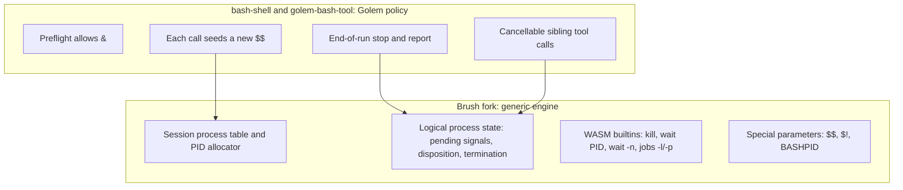
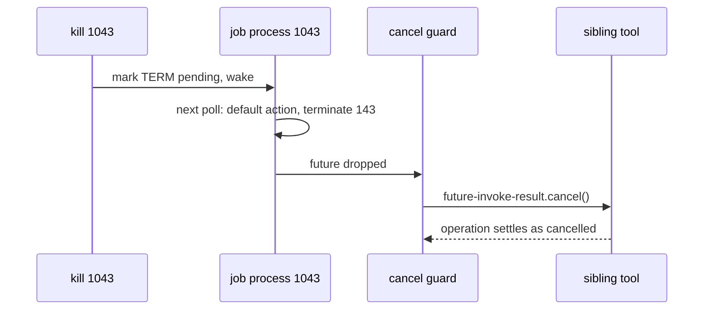

# Process model v1 for Golem's built-in bash tool

Status: approved, 2026-09-22.

## Overview

Golem's built-in bash tool (`plugins/builtin-tools/bash` in the Golem repository) runs one finite
script per `run` call inside a fresh Brush shell, on a single cooperative WASM thread. It has no
process model: `&`, `wait` and `coproc` are refused before execution, `kill` does not exist on WASM,
`$!` is empty, `BASHPID` is unset, and `$$` aborts the component because Brush expands it with
`std::process::id()`, which panics on `wasm32-wasip2` ("no pids on this platform").

This design adds a synthetic process model scoped to a single `run`: numbered background jobs with
`&`, `wait`, `jobs`, `kill`, `$!`, `$$` and `BASHPID`, catchable TERM/INT/HUP, and deterministic
cleanup of jobs still running when the script ends. It keeps the tool's published `run` signature
and result format unchanged.

Out of scope for v1: `ps`, `/proc`, process substitution, `coproc`, `fg`, `bg`, `disown`,
`wait -p`/`-f`, and any job that outlives the `run` call that started it. (Since then, the
conformance sweep added buffered process substitution and `disown`; see the README. On 2026-09-24
the tool stopped carrying any state between calls, so `$$` is now new in every call rather than
fixed for a session; the sections below say so where it matters.)

## Feasibility findings this design relies on

All references are to the Brush fork at `360af58f` (branch `cooperative-pipe-correctness`, rebased
onto upstream `737dd57e`) and Golem at `builtin-bash-tool`.

- `brush-core/src/execution.rs` provides `ExecutionServices::spawn`, owned `LocalTaskHandle`s with
  `abort`/`join`, and a `TaskScope` tree: aborting a task aborts its descendants and awaits their
  cleanup. This is the process tree.
- `brush-core/src/execution/process.rs` provides `run_process`, a logical process with its own
  SIGPIPE disposition, a `terminated` flag that ends it with `128 + 13`, and a nested task scope. It
  is installed as the current process only while its future is polled. Only SIGPIPE uses it today.
- `interp.rs::spawn_async_ao_list_in_task` already implements `&` on WASM: it clones the `Shell`
  (isolated cwd, environment, functions, open files), redirects stdin to `/dev/null`, spawns the
  list as a task and registers a `Job` with `JobTask::Internal`. It does not wrap the job in
  `run_process`. `jobs.rs` has `Job::abort` (exit 137) and upstream's `kill -0` support.
- `brush-builtins` registers `kill` only under `cfg(unix)`. `wait` supports `%job` and "wait for
  all", but `wait PID` and `wait -n` are `unimp`.
- The component's `yield_now` lets CPU-bound shell code yield: a 50 ms timer stage completes while a
  compute loop in a sibling stage is still running.
- Golem runs a tool body as one export in a transient Store and destroys the Store when the export
  returns (`golem-worker-executor/src/worker/instance.rs`, `invoke_scoped`). No shell task can
  outlive `run`. Admitted sibling tool calls, including fire-and-forget ones, settle before the
  parent operation completes.
- A sibling tool call is cancelled only by `future-invoke-result.cancel()`
  (`golem:tool/host`); dropping the handle detaches observation and does not cancel accepted work.
  `cancel` is effective for live and incomplete-replay calls and a no-op for completed replays.
- Finite uutils run through `run_uu`, which swaps process-global cwd and stdio synchronously and
  never across an await. Concurrent jobs are therefore safe, but such a utility cannot be preempted
  or killed mid-call and buffers its whole input first.

## Design

### Ownership

The Brush fork gains only mechanism that any embedder could use. Everything Golem-specific (the
per-call `$$`, the end-of-run policy, sibling tool cancellation) stays in the bash tool's crates.

### Brush: process table and PIDs

A session-wide `ProcessTable` is shared by the shell and every subshell or job clone of it
(reference-counted, not copied, so clones cannot hand out duplicate numbers). Each entry records:

| Field | Meaning |
|---|---|
| `pid` | Synthetic process number |
| `ppid` | Number of the process that started it |
| `command` | Command text, as `jobs` displays it |
| `state` | `Running`, `Exited(code)` or `Signaled(signal)` |

The table owns a monotonic allocator seeded by the embedder with the shell's own number and the
next number to hand out. Numbers wrap at 4,194,303 (Linux's `pid_max` ceiling) and skip the shell's
own number.

PIDs are assigned where they are observable:

- the main script, which runs as a logical process numbered `$$`, so `kill $$` reaches it;
- each background job's process, and each stage of a background pipeline (`$!` is the last stage);
- each subshell, pipeline stage and command substitution, with its own `BASHPID`, so
  `(kill $BASHPID)` ends only that subshell, as in bash;
- each child shell (`sh -c`, `bash -c`, and those `find -exec` and `xargs` start), which also has
  its own `$$`, so `bash -c 'kill $$'` ends only the child and concurrent children do not share
  `/tmp/x.$$` names;
- an output process substitution that `exec` makes a shell descriptor (`exec > >(tee log)`).

Commands that run in-process to completion (the coreutils, `sed`, `jq`) do not consume numbers:
nothing can name them while they run.

Special parameters:

- `$$` returns the seeded shell number instead of calling `std::process::id()`.
- `$!` returns the number of the most recent background job's last stage, or is empty. It is the
  shell's own value, kept after `wait`, `disown` and `wait -n` and inherited by subshells.
- `BASHPID` is defined on WASM as described above.

### Brush: signals

`ProcessState` generalizes from SIGPIPE-only to a pending-signal set with a disposition per signal:
default, ignored or caught. All 64 Linux signals exist, named and numbered as bash on Linux with
musl names them (`kill -l`); 32 to 34 have numbers but no names. Their default actions are
Linux's: most terminate the process; CHLD, URG and WINCH are ignored; STOP, TSTP, TTIN and TTOU
stop it and CONT continues it. A stopped process is not polled, and a signal other than KILL
waits until it continues. `trap` installs every valid signal it is given and reports the invalid
ones, with status 1, as bash does.

- Delivery marks the signal pending on the target process and wakes it. Delivery to a job targets
  every process in the job.
- At the existing trap safe point (`commands.rs`, where `take_pending_pipe_trap` is consulted), a
  pending caught signal runs its handler in that process's shell. Execution then continues unless
  the handler exits.
- A pending signal with the default action terminates the process with `128 + signal` at its next
  poll, the same path SIGPIPE uses today.
- KILL cannot be caught or ignored and terminates at the next poll. STOP cannot be caught either.
- A shell a signal other than KILL ends still runs its EXIT trap, whose `exit` cannot change the
  status `128 + signal`. Every subshell, stage, substitution and job runs only an EXIT trap it sets
  itself, when it ends.
- A trapped signal interrupts `wait`, which returns `128 + signal` at once; the trap then runs.
- A foreground command a signal ended is reported as bash reports it (`Terminated` and the command
  for TERM; the line, number and description for other signals but INT and PIPE); so is a job
  `wait` finds a signal other than INT, TERM and PIPE ended.
- A process inside a synchronous `run_uu` call observes signals only when that call returns.

Job inheritance follows bash for asynchronous commands without job control:

- Caught handlers reset to default in the job, as `reset_pipe_for_subshell` already does for PIPE.
  A cleanup trap must therefore be set inside the job, as in bash: `( trap 'rm -f "$t"' TERM; … ) &`.
- INT and QUIT are ignored in background jobs once they run; one sent before a job's first turn
  still ends it, as bash's does before its child ignores them.
- A background job reads `/dev/null`, unless the subshell or compound command it runs in reads a
  pipe or redirects standard input (bash's `stdin_redir`): `echo hi | { cat & wait; }` prints `hi`.

Where bash's behavior is subtle, the Bash 5 oracle in the cooperative matrix is the reference.

### Brush: builtins on WASM

| Builtin | v1 behavior |
|---|---|
| `kill` | `kill [-s SIG \| -SIG \| -n N] pid\|%job ...`, `kill -l [status]`, `kill -0 pid`, parsed and worded as bash's. Default TERM. `kill 0` signals every process of the call. Targets are this session's processes only. |
| `wait` | No operands: wait for all jobs, forget them and return 0. `wait PID`/`wait %N`: return that job's status; the job leaves the table at the next cleanup (a new job, or `jobs`), and `wait PID` returns the status again later. `wait -n [ids]`: wait for the next job (among `ids`) to finish and return its status, or 127 if none remain; it sleeps until a job ends rather than polling. |
| `jobs` | Bash's formatting, one line per job (subshells and groups inline, loops as bash prints them), `Done`, `Exit N` or how a signal ended it. `-l` adds numbers, one line per pipeline stage; `-p` prints the first number; `-n` only jobs not yet listed in their state; `%N`, `%name` and `%?text` select jobs. `-x cmd args` runs `cmd` with each job spec among `args` replaced by the job's process group, which without job control is `$$`. |
| `suspend` | Without job control: `cannot suspend: no job control`, status 1. |

`disown` was added later (see the note above and the README); it is not one of the v1 exclusions
any more.

A subshell, stage or substitution lists its parent's jobs, as bash does, but cannot wait for or
signal them.

`bg`, `fg`, `wait -p`, `wait -f` and `suspend -f` remain unsupported.

Background jobs are wrapped in `run_process` so each has process state. They run in the call's job
scope, apart from the process that starts them, so a job outlives the subshell, stage,
substitution or child shell that started it, as an orphaned process does. At most 256 jobs may be
running at once in the whole call, however deeply nested and whether disowned or not. At the cap,
jobs just started get up to 64 turns to finish; if none does, starting another fails that command
with bash's `fork: retry: Resource temporarily unavailable` and status 1.

### Bash tool: preflight

`stateless.rs` stops refusing `&`. It continues to refuse `coproc` with the existing message and
status 2; process substitution was later added, buffered (see the note above and the README), so
it is no longer refused. `bg`, `fg` and `fc` stay refused. The `wait` refusal is removed, because
`wait` now has meaning.

### Bash tool: `$$` per call

Every call is a new shell process with its own numbers; the tool carries nothing between calls:

- `$$` is drawn uniformly from 1,000–4,194,303 using the guest's random source.
- The first number the table hands out is `$$ + 1`.

A random rather than fixed `$$` means two calls on the same agent, concurrent or not, do not
collide on names like `/tmp/out.$$`. Golem records guest randomness, so replay draws the same
number. (Until 2026-09-24 the state carried `$$` and the next number, so `$$` stayed fixed for a
session.)

### Bash tool: end of run

When the script finishes (normally, through `exit`, or through a signal to `$$`, after its EXIT
trap), the shell's descriptors close, an output process substitution `exec` made gets up to 64
turns to finish, and then:

1. Every job still running is sent HUP: jobs of the script (listed or disowned), and jobs that
   subshells, stages, substitutions and child shells started.
2. The tool waits until those jobs exit, or until 1 second passes on the durable monotonic clock.
   The second is one timer raced against the jobs ending, so a run that ends with leftover jobs
   creates at most one grace timer, however long their handlers take. (A loop of short sleeps
   would make the number of timers depend on how far local compute got, which replay cannot
   reproduce.) A job that ends while others still run is marked in the durable record with a
   zero-length sleep; replay cannot release the grace timer before it has passed those marks, so
   the jobs that ended before the timer live also end before it on replay.
3. Remaining jobs are sent KILL, and their sibling tool calls are cancelled (below).
4. One line per stopped job is appended to the result's stderr:
   `bash: stopped job [1] (pid 1043, hangup): sleep 1000` or `(pid 1043, killed)`. A job the
   script did not start itself has no job number: `bash: stopped job (pid 1044, hangup): …`.

The script's own exit status is returned unchanged. A job that finished before the script ended is
not reported. This deliberately differs from bash, whose non-interactive scripts leave background
jobs running after exit, because a job cannot survive the transient Store.

### Bash tool: cancellable sibling tool calls

`component/src/transport.rs` switches from `tool-rpc.invoke-and-await` to
`tool-rpc.async-invoke-and-await`, keeping the `future-invoke-result` handle.

- A guard owned by the bound-tool command calls `cancel()` if the owning process is terminated by a
  signal (a `kill`, or the end-of-run HUP/KILL) before `get()` returns.
- Reader closure keeps its existing contract and never cancels accepted work. A bound tool writes
  its output only after the call completes, so a broken pipe cannot terminate a process while its
  call is pending.
- Effects the tool already performed remain. Golem records the cancellation durably.

### Replay safety

Recovery re-executes the bash body from the start. Every input that determines a number, an order
or a result is either in the call's input or recorded by Golem:

- the random `shell_pid`;
- timers, including the 1-second grace;
- sibling calls and their cancellation;
- the completion order the guest observed.

A recovered run therefore allocates the same numbers and produces byte-identical output. This is
required, because Golem compares the reconstructed result with the recorded one and treats any
difference as permanent divergence. No design element reads wall-clock time or unrecorded
randomness.

One external effect is not exactly-once. An HTTP request that had not finished when the agent
crashed is sent again on recovery: an idempotent method (GET, HEAD, PUT, DELETE, OPTIONS, TRACE)
with the same `Idempotency-Key` header, a POST or PATCH with a new one, because Golem assumes by
default that a non-idempotent write may be retried. The server may therefore see an interrupted
POST or PATCH twice; a script that needs exactly-once sends its own `Idempotency-Key`, which Golem
keeps on the resent request. `curl -m` and `wget -T` do not race a durable timer against the
request: Golem's recovery of an interrupted POST discards the oplog range after the request's
start by position, including the entries of a timer racing it, and the replay then failed and
left the agent unusable. They use WASI-HTTP's own timeouts instead (see the README's HTTP
limits). The call's own time limit (`run`'s `timeout`) keeps its single timer, armed before the
script runs so that its clock calls precede anything the script does in the oplog; left to be
armed at the script's first wait, it too could fall inside that range.

## Error Handling

| Situation | Outcome |
|---|---|
| `kill` target is not a process of this session | `kill: (N) - No such process`, status 1 |
| Invalid signal name or number | `kill: SIG: invalid signal specification`, status 1 |
| `wait` on a number that is not this shell's job | bash's message, status 127 |
| 257th concurrent job | `fork: retry: Resource temporarily unavailable`, status 1 for that command |
| `cancel()` fails or the call already completed | Ignored. The job is still reported as stopped. |
| Unsupported job control (`fg`, `bg`, `wait -p`, `wait -f`) | Existing unsupported-in-bash-tool message, status 2 |
| `coproc` | Still refused before execution, status 2 |

## Testing

1. **Brush fork unit tests** (native, current-thread `LocalSet`):
   - allocation, wrap and skip;
   - signal delivery at safe points;
   - `128 + n` statuses;
   - a caught handler that continues;
   - an uncatchable KILL;
   - INT ignored in jobs;
   - `wait PID`, `wait -n`, `jobs -l`/`-p`;
   - `kill -0`, `kill -l` and invalid input.
2. **Bash tool crate tests:**
   - a new `$$` in every call;
   - preflight allows `&` and process substitution, and still refuses `coproc`;
   - the end-of-run sequence and its stderr lines, using test execution services.
3. **Cooperative WASM matrix** against the Bash 5 oracle: `&`, `wait`, `wait -n`, `$!`, `kill`,
   trap handlers, inheritance and statuses, comparing exact stdout, stderr and status. Cases print
   facts derived from numbers (equality, ordering, status), never raw numbers, since the two shells
   allocate differently.
4. **Golem CLI integration**, with the existing checkpoint fixture:
   - `$$` no longer aborts, and each call gets a new one;
   - `kill` of a job waiting on `fixture checkpoint` cancels it, and `after` is never written;
   - end-of-run stopping cancels a pending sibling call;
   - a simulated crash during a run with live jobs recovers the identical result, with every
     effect exactly once.

## Alternatives Considered

- **Everything in the Brush fork.** Rejected. It puts Golem policy (the per-call `$$`, end-of-run
  reporting, tool cancellation) in a general shell library and enlarges a fork that must be rebased
  regularly.
- **Everything in the bash tool crate, with thin Brush hooks.** Rejected. Job and process internals
  live in `brush-core`, so the tool would duplicate them or reach into them through awkward hooks.
- **Wait for leftover jobs at the end of the script.** Rejected. `sleep 1000 &` would hold the call
  for 1,000 seconds.
- **Treat leftover jobs as an error.** Rejected as surprising for bash users.
- **Report stopped jobs in a new structured result field.** Rejected for v1. It changes the
  published result schema and needs a new tool version. A stderr line carries the same information.
- **Stop only the shell side of a killed job and let its tool call finish.** Rejected. `kill` would
  not stop the work, and the operation would still wait for the call to settle.
- **A `$$` fixed for a session.** Chosen at first, and carried in the state. Dropped on
  2026-09-24 with the state itself: a call keeps nothing from the previous one, so a script that
  needs a name in a later call writes it to a file.
- **A fixed `$$`.** Rejected. Concurrent calls on one agent would collide on `$$`-named files.
- **Jobs that survive across calls.** Deferred. Golem destroys the tool's Store when `run` returns,
  and sibling work settles before the operation completes. This needs a new executor feature for
  durably starting detached work.
- **Kill-only signals without traps.** Rejected. Cleanup traps are a common idiom, and the fork's
  SIGPIPE mechanism generalizes directly.

## Open Questions

- The job cap (256) and the grace period (1 second) are initial values. Should either be
  configurable per binding, or remain constants until real workloads suggest otherwise?
- Upstreaming: the generic engine (session process table, signal generalization, WASM `kill` and
  `wait`) is a candidate for upstream Brush. It should be proposed after v1 has settled in the fork.
